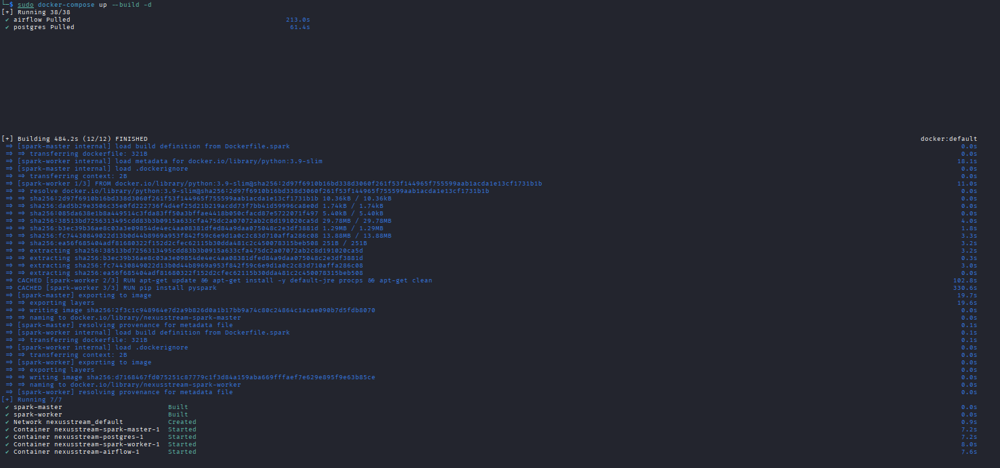
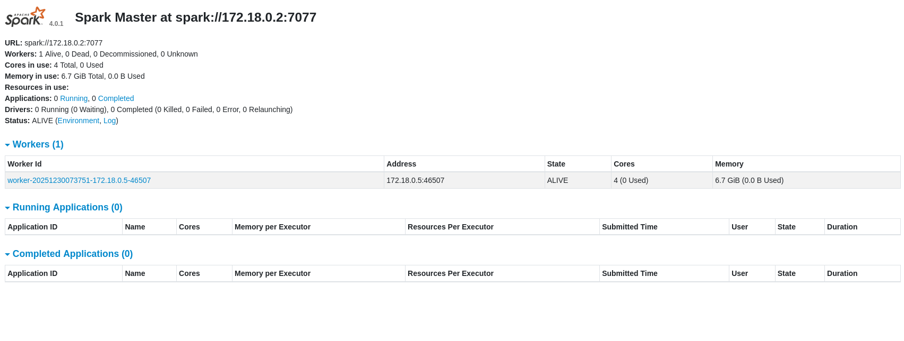
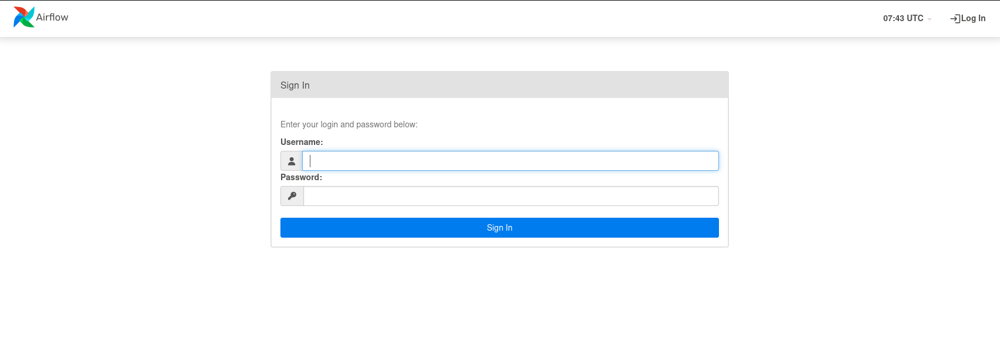
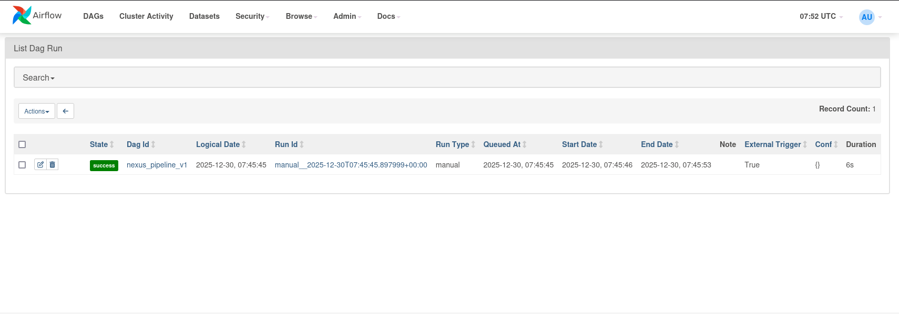

# 🚀 NexusStream: End-to-End Data Pipeline Orchestration

A robust data engineering infrastructure built on **Kali Linux** using **Apache Airflow** and **Apache Spark**. This project demonstrates the ability to manage complex container networking and automated job scheduling.

## 🏗 System Architecture
- **Orchestration:** Apache Airflow 2.7.1
- **Processing Engine:** Apache Spark 3.5.0 (Custom Docker Build)
- **Database:** PostgreSQL 13
- **Infrastructure:** Docker Compose

## 🛠 Key Technical Achievements
- **Containerization:** Developed custom Dockerfiles to handle Spark environment dependencies.
- **Workflow Automation:** Designed a directed acyclic graph (DAG) to trigger and monitor Spark tasks.
- **Troubleshooting:** Successfully managed Linux-based permission constraints and integrated dynamic library injections via `_PIP_ADDITIONAL_DEPENDENCIES`.

## 🟢 Visual Verification

| 1. Environment Build | 2. Spark Cluster Health |
| :---: | :---: |
|  |  |
| *Building custom images* | *Workers are ALIVE & Ready* |

| 3. System Access | 4. Pipeline Success (DAG) |
| :---: | :---: |
|  |  |
| *Secure standalone access* | *Green light - Pipeline Finished* |

## 🔮 Future Improvements
To take this pipeline to the next level, the following features are planned:
- **Real-time Streaming:** Integration with **Apache Kafka** for live data ingestion.
- **Cloud Storage:** Connecting the pipeline to **AWS S3** or **Google Cloud Storage** for scalable data archiving.
- **Advanced Monitoring:** Implementing **Grafana & Prometheus** to track Spark cluster performance and resource usage.
- **Data Quality:** Adding **Great Expectations** for automated data validation within the DAG.

## 🚀 Deployment Guide
1. Clone the repo.
2. Run `sudo docker-compose up --build -d`.
3. Spark Master UI: http://localhost:8080

4. Airflow UI: http://localhost:8081
